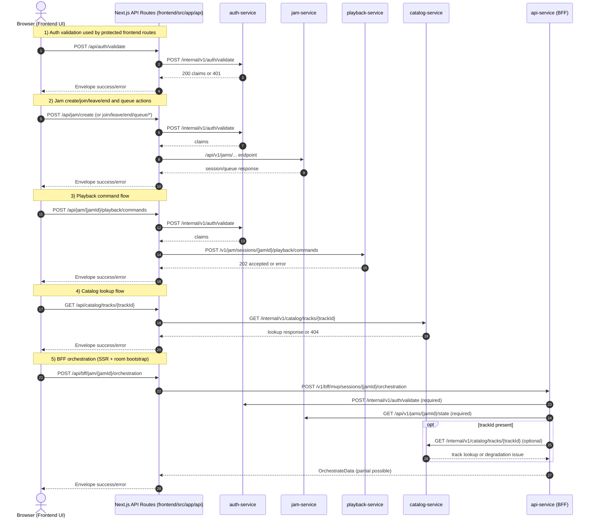
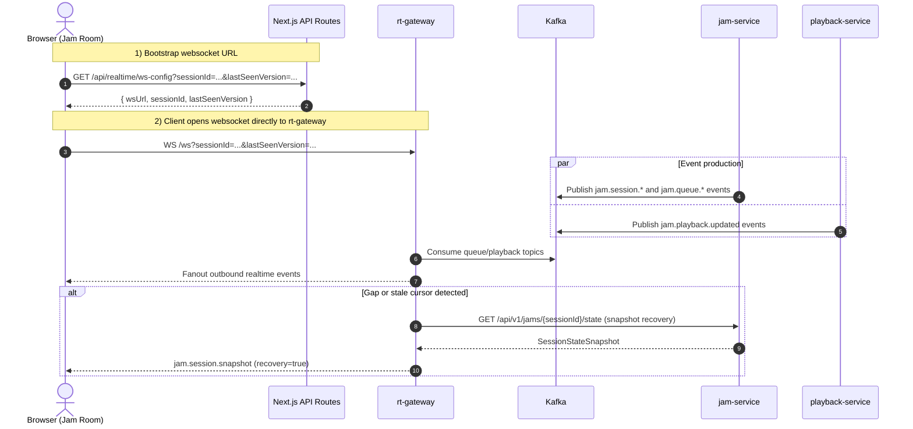

# Frontend -> Backend Service Call Sequence

This document reflects the current implementation flow for frontend requests and realtime updates.

## How To Use With Guardrail

- Treat .github/instructions/frontend/fe-frontend-backend-sequence-flow.instructions.md as the implementation guardrail.
- Treat this document as the executable contract for frontend page flows and route-to-service mapping.
- For any frontend jam-flow change, update code and this doc in one change so behavior and documentation stay in sync.

## Page-Ordered Flow (Runtime Order)

The sections below are intentionally ordered by page runtime path.

### 1) Lobby Page (`/`)

- Entry file: frontend/src/app/page.tsx
- Client feature: frontend/src/components/jam/lobby-client.tsx
- Primary user actions:
    - Create Jam
    - Join Jam
- Frontend API routes used in order:
    - `POST /api/auth/validate` (create pre-check)
    - `POST /api/jam/create` (create flow)
    - `POST /api/jam/{jamId}/join` (join flow)
- UI primitives used from frontend/src/components/ui:
    - Card, Tabs, Input, Button, Alert, Toast

### 2) Jam Page SSR Bootstrap (`/jam/{jamId}`)

- Entry file: frontend/src/app/jam/[jamId]/page.tsx
- Server-side bootstrap action:
    - `POST /api/bff/jam/{jamId}/orchestration`
- Purpose:
    - Load initial room state before client hydration
    - Pass initial view and initial data/error to JamRoomClient

### 3) Jam Room Client Runtime

- Client feature: frontend/src/components/jam/jam-room-client.tsx
- Runtime flow order:
    - Hydrate with SSR orchestration data
    - Start periodic orchestration refresh (SWR)
    - Bootstrap websocket config via `GET /api/realtime/ws-config`
    - Open websocket to rt-gateway `/ws`
    - Process realtime events and run snapshot recovery when needed
- User action flows:
    - Queue actions: add/remove/reorder
    - Playback commands: play/pause/next/prev/seek
    - End session (host)
- Frontend API routes used:
    - `GET /api/jam/{jamId}/state`
    - `GET /api/jam/{jamId}/queue/snapshot`
    - `POST /api/jam/{jamId}/queue/add`
    - `POST /api/jam/{jamId}/queue/remove`
    - `POST /api/jam/{jamId}/queue/reorder`
    - `POST /api/jam/{jamId}/playback/commands`
    - `POST /api/jam/{jamId}/end`
- UI primitives used from frontend/src/components/ui:
    - Layout/status: Badge, Separator, Skeleton
    - Inputs/actions: Input, Button, Slider
    - Navigation/content: Tabs, Card, ScrollArea
    - Interactive overlays: Dialog, DropdownMenu, Tooltip
    - Feedback/identity: Alert, Toast, Avatar

## UI Component Usage Approach (By Page)

When implementing or reviewing jam flows, keep UI usage tied to page responsibility and flow order.

| Page | UX responsibility | UI primitives (frontend/src/components/ui) |
| --- | --- | --- |
| `/` Lobby | Session entry and entitlement-safe create/join | Card, Tabs, Input, Button, Alert, Toast |
| `/jam/{jamId}` SSR | Initial orchestration bootstrap and error handoff | Alert (error fallback) |
| `/jam/{jamId}` Room | Realtime collaboration and host controls | Tabs, Card, ScrollArea, DropdownMenu, Tooltip, Slider, Dialog, Badge, Avatar, Alert, Toast, Button, Input, Skeleton, Separator |

## Guardrail Compliance Checklist

- Page order preserved: Lobby -> Jam SSR bootstrap -> Jam room runtime.
- Browser requests stay on frontend-owned `/api/**` routes.
- Route-to-service mapping matches this document.
- BFF orchestration semantics preserved:
    - Required: auth-service + jam-service
    - Optional/degradable: catalog-service + playback-service
- Realtime bootstrap preserved:
    - `GET /api/realtime/ws-config`
    - websocket connect to rt-gateway `/ws`
- Any new page flow or endpoint mapping change updates this document in the same PR.

## Scope

- Frontend client and Next.js App Router route handlers under frontend/src/app/api/**
- Backend services under backend/**:
  - auth-service
  - jam-service
  - playback-service
  - catalog-service
  - api-service (BFF)
  - rt-gateway
- Kafka fanout path used by realtime updates

## Service Base URLs (frontend config defaults)

- auth-service: http://localhost:8081
- jam-service: http://localhost:8080
- playback-service: http://localhost:8082
- catalog-service: http://localhost:8083
- api-service (BFF): http://localhost:8084
- rt-gateway: http://localhost:8085

## Sequence 1: HTTP Request/Response Flow

## Sequence 2: Realtime WebSocket + Kafka Fanout Flow

## Frontend Route -> Backend Endpoint Mapping

| Frontend route | Backend service | Upstream endpoint |
| --- | --- | --- |
| POST /api/auth/validate | auth-service | POST /internal/v1/auth/validate |
| POST /api/jam/create | auth-service -> jam-service | POST /internal/v1/auth/validate, POST /api/v1/jams/create |
| POST /api/jam/{jamId}/join | auth-service -> jam-service | POST /internal/v1/auth/validate, POST /api/v1/jams/{jamId}/join |
| POST /api/jam/{jamId}/leave | auth-service -> jam-service | POST /internal/v1/auth/validate, POST /api/v1/jams/{jamId}/leave |
| POST /api/jam/{jamId}/end | auth-service -> jam-service | POST /internal/v1/auth/validate, POST /api/v1/jams/{jamId}/end |
| GET /api/jam/{jamId}/state | jam-service | GET /api/v1/jams/{jamId}/state |
| GET /api/jam/{jamId}/queue/snapshot | jam-service | GET /api/v1/jams/{jamId}/queue/snapshot |
| POST /api/jam/{jamId}/queue/add | auth-service -> jam-service | POST /internal/v1/auth/validate, POST /api/v1/jams/{jamId}/queue/add |
| POST /api/jam/{jamId}/queue/remove | auth-service -> jam-service | POST /internal/v1/auth/validate, POST /api/v1/jams/{jamId}/queue/remove |
| POST /api/jam/{jamId}/queue/reorder | auth-service -> jam-service | POST /internal/v1/auth/validate, POST /api/v1/jams/{jamId}/queue/reorder |
| POST /api/jam/{jamId}/playback/commands | auth-service -> playback-service | POST /internal/v1/auth/validate, POST /v1/jam/sessions/{jamId}/playback/commands |
| GET /api/catalog/tracks/{trackId} | catalog-service | GET /internal/v1/catalog/tracks/{trackId} |
| POST /api/bff/jam/{jamId}/orchestration | api-service (BFF) | POST /v1/bff/mvp/sessions/{jamId}/orchestration |
| GET /api/realtime/ws-config | none (frontend-local config) | returns rt-gateway ws URL |

## Notes

- Frontend route handlers normalize backend errors into a common envelope.
- auth-service token validation is the shared gate for protected mutations.
- api-service BFF treats auth and jam as required dependencies; catalog can degrade and still return partial orchestration data.
- Orchestration is side-effect free. Playback mutations are accepted only on `POST /api/jam/{jamId}/playback/commands`; sending `playbackCommand` to orchestration returns `400 invalid_input`.
- rt-gateway fanout uses Kafka events and can recover client gaps by fetching jam-service state snapshots.
