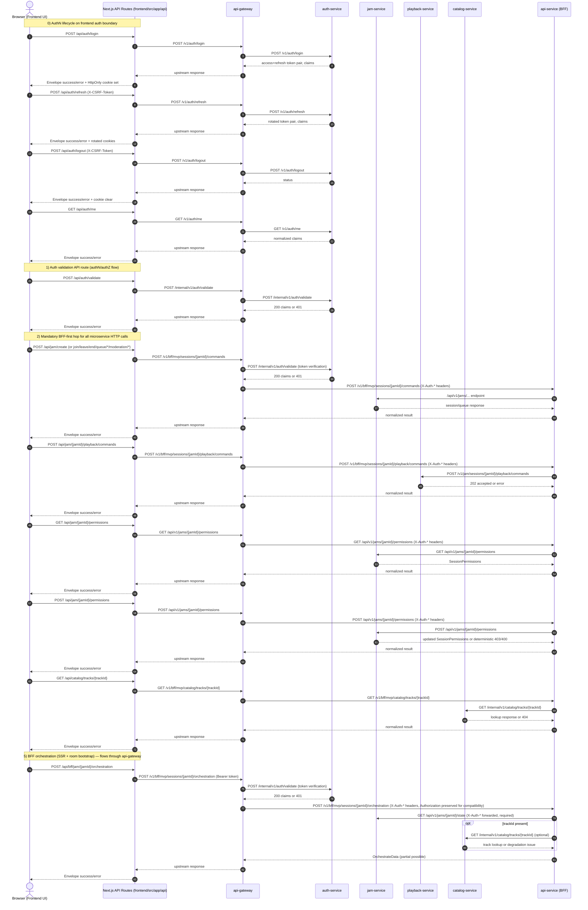
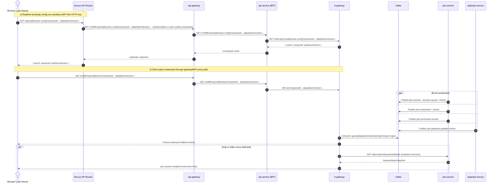

# Frontend -> Backend Service Call Sequence

This document reflects the current implementation flow for frontend requests and realtime updates.

## How To Use With Guardrail

- Treat .github/instructions/frontend/fe-frontend-backend-sequence-flow.instructions.md as the implementation guardrail.
- Treat this document as the executable contract for frontend page flows and route-to-service mapping.
- For any frontend jam-flow change, update code and this doc in one change so behavior and documentation stay in sync.

## Page-Ordered Flow (Runtime Order)

The sections below are intentionally ordered by page runtime path.

### 1) Login Page (`/login`)

- Entry file: frontend/src/app/login/page.tsx
- Client feature: frontend/src/components/auth/login-form.tsx
- Primary user actions:
    - Submit identity/password login form
    - Receive normalized error feedback for invalid credentials
- Frontend API routes used in order:
    - `POST /api/auth/login`
    - `POST /api/auth/refresh` (session renewal path)
    - `POST /api/auth/logout` (session termination path)
    - `GET /api/auth/me` (current-claims lookup)
- UI primitives used from frontend/src/components/ui:
    - Card, Input, Button, Alert, Separator, Toast

### 2) Lobby Page (`/`)

- Entry file: frontend/src/app/page.tsx
- Client feature: frontend/src/components/jam/lobby-client.tsx
- Primary user actions:
    - Create Jam
    - Join Jam
- Frontend API routes used in order:
    - `POST /api/auth/validate` (create pre-check)
    - `POST /api/jam/create` (create flow)
    - `POST /api/jam/{jamId}/join` (join flow)
- UI primitives used from frontend/src/components/ui:
    - Card, Tabs, Input, Button, Alert, Toast

### 3) Jam Page SSR Bootstrap (`/jam/{jamId}`)

- Entry file: frontend/src/app/jam/[jamId]/page.tsx
- Server-side bootstrap action:
    - `POST /api/bff/jam/{jamId}/orchestration`
- Purpose:
    - Load initial room state before client hydration
    - Pass initial view and initial data/error to JamRoomClient

### 4) Jam Room Client Runtime

- Client feature: frontend/src/components/jam/jam-room-client.tsx
- Runtime flow order:
    - Hydrate with SSR orchestration data
    - Start periodic orchestration refresh (SWR)
    - Bootstrap websocket config via `GET /api/realtime/ws-config`
    - Open websocket to rt-gateway `/ws`
    - Process realtime events and run snapshot recovery when needed
- User action flows:
    - Queue actions: add/remove/reorder
    - Moderation actions (host): mute/kick participants
    - Permission projection updates (host): playback/reorder/volume guest toggles
    - Playback commands: play/pause/next/prev/seek
    - End session (host)
- Frontend API routes used:
    - `GET /api/jam/{jamId}/state`
    - `GET /api/jam/{jamId}/queue/snapshot`
    - `POST /api/jam/{jamId}/queue/add`
    - `POST /api/jam/{jamId}/queue/remove`
    - `POST /api/jam/{jamId}/queue/reorder`
    - `POST /api/jam/{jamId}/moderation/mute`
    - `POST /api/jam/{jamId}/moderation/kick`
    - `GET /api/jam/{jamId}/permissions`
    - `POST /api/jam/{jamId}/permissions`
    - `POST /api/jam/{jamId}/playback/commands`
    - `POST /api/jam/{jamId}/end`
- UI primitives used from frontend/src/components/ui:
    - Layout/status: Badge, Separator, Skeleton
    - Inputs/actions: Input, Button, Slider
    - Navigation/content: Tabs, Card, ScrollArea
    - Interactive overlays: Dialog, DropdownMenu, Tooltip
    - Feedback/identity: Alert, Toast, Avatar

## UI Component Usage Approach (By Page)

When implementing or reviewing jam flows, keep UI usage tied to page responsibility and flow order.

| Page | UX responsibility | UI primitives (frontend/src/components/ui) |
| --- | --- | --- |
| `/login` | Authentication entry and credential session bootstrap | Card, Input, Button, Alert, Separator, Toast |
| `/` Lobby | Session entry and entitlement-safe create/join | Card, Tabs, Input, Button, Alert, Toast |
| `/jam/{jamId}` SSR | Initial orchestration bootstrap and error handoff | Alert (error fallback) |
| `/jam/{jamId}` Room | Realtime collaboration and host controls | Tabs, Card, ScrollArea, DropdownMenu, Tooltip, Slider, Dialog, Badge, Avatar, Alert, Toast, Button, Input, Skeleton, Separator |

## Guardrail Compliance Checklist

- Page order preserved: Lobby -> Jam SSR bootstrap -> Jam room runtime.
- Page order preserved: Login -> Lobby -> Jam SSR bootstrap -> Jam room runtime.
- Browser requests stay on frontend-owned `/api/**` routes.
- Route-to-service mapping matches this document.
- BFF orchestration semantics preserved:
    - Required: auth-service + jam-service
    - Optional/degradable: catalog-service + playback-service
- Realtime bootstrap preserved:
    - `GET /api/realtime/ws-config`
    - websocket connect to rt-gateway `/ws`
- Any new page flow or endpoint mapping change updates this document in the same PR.

## Scope

- Frontend client and Next.js App Router route handlers under frontend/src/app/api/**
- Backend services under backend/**:
  - auth-service
  - jam-service
  - playback-service
  - catalog-service
  - api-service (BFF)
  - rt-gateway
- Kafka fanout path used by realtime updates

## Service Base URLs (frontend config defaults)

- api-gateway (public ingress): http://localhost:8085
- auth-service: http://localhost:8081
- jam-service: http://localhost:8080
- playback-service: http://localhost:8082
- catalog-service: http://localhost:8083
- api-service (BFF, internal only): http://localhost:8084
- rt-gateway: http://localhost:8086

> **Note**: `api-gateway` (port 8085) is the sole public entry point for all BFF and auth flows. `api-service` (port 8084) is internal-only and not reachable from browsers or frontend servers directly.

## Sequence 1: HTTP Request/Response Flow

## Sequence 2: Realtime WebSocket + Kafka Fanout Flow

## Frontend Route -> Backend Endpoint Mapping

| Frontend route | Backend service | Upstream endpoint |
| --- | --- | --- |
| POST /api/auth/login | api-gateway -> auth-service | POST /v1/auth/login |
| POST /api/auth/refresh | api-gateway -> auth-service | POST /v1/auth/refresh |
| POST /api/auth/logout | api-gateway -> auth-service | POST /v1/auth/logout |
| GET /api/auth/me | api-gateway -> auth-service | GET /v1/auth/me |
| POST /api/auth/validate | api-gateway -> auth-service | POST /internal/v1/auth/validate |
| POST /api/jam/create | api-gateway -> api-service (BFF) -> jam-service | POST /api/v1/jams/create |
| POST /api/jam/{jamId}/join | api-gateway -> api-service (BFF) -> jam-service | POST /api/v1/jams/{jamId}/join |
| POST /api/jam/{jamId}/leave | api-gateway -> api-service (BFF) -> jam-service | POST /api/v1/jams/{jamId}/leave |
| POST /api/jam/{jamId}/end | api-gateway -> api-service (BFF) -> jam-service | POST /api/v1/jams/{jamId}/end |
| GET /api/jam/{jamId}/state | api-gateway -> api-service (BFF) -> jam-service | GET /api/v1/jams/{jamId}/state |
| GET /api/jam/{jamId}/queue/snapshot | api-gateway -> api-service (BFF) -> jam-service | GET /api/v1/jams/{jamId}/queue/snapshot |
| POST /api/jam/{jamId}/queue/add | api-gateway -> api-service (BFF) -> jam-service | POST /api/v1/jams/{jamId}/queue/add |
| POST /api/jam/{jamId}/queue/remove | api-gateway -> api-service (BFF) -> jam-service | POST /api/v1/jams/{jamId}/queue/remove |
| POST /api/jam/{jamId}/queue/reorder | api-gateway -> api-service (BFF) -> jam-service | POST /api/v1/jams/{jamId}/queue/reorder |
| POST /api/jam/{jamId}/moderation/mute | api-gateway -> api-service (BFF) -> jam-service | POST /api/v1/jams/{jamId}/moderation/mute |
| POST /api/jam/{jamId}/moderation/kick | api-gateway -> api-service (BFF) -> jam-service | POST /api/v1/jams/{jamId}/moderation/kick |
| GET /api/jam/{jamId}/permissions | api-gateway -> api-service (BFF) -> jam-service | GET /api/v1/jams/{jamId}/permissions |
| POST /api/jam/{jamId}/permissions | api-gateway -> api-service (BFF) -> jam-service | POST /api/v1/jams/{jamId}/permissions |
| POST /api/jam/{jamId}/playback/commands | api-gateway -> api-service (BFF) -> playback-service | POST /v1/jam/sessions/{jamId}/playback/commands |
| GET /api/catalog/tracks/{trackId} | api-gateway -> api-service (BFF) -> catalog-service | GET /internal/v1/catalog/tracks/{trackId} |
| POST /api/bff/jam/{jamId}/orchestration | api-gateway -> api-service (BFF) | POST /v1/bff/mvp/sessions/{jamId}/orchestration |
| GET /api/realtime/ws-config | api-gateway -> api-service (BFF) | GET /v1/bff/mvp/realtime/ws-config |
| Browser websocket connect | api-gateway -> api-service (BFF) -> rt-gateway | WS /v1/bff/mvp/realtime/ws -> /ws |

## Notes

- Frontend route handlers normalize backend errors into a common envelope.
- Frontend auth routes issue `auth_token` and `refresh_token` as HttpOnly cookies and enforce CSRF header matching for refresh/logout.
- auth-service token validation remains the shared gate for protected mutations through api-gateway validation middleware.
- **api-gateway is the sole public ingress**. It validates Bearer tokens via `POST /internal/v1/auth/validate` on auth-service, preferring `Authorization` and falling back to `auth_token`/`token` cookies when header auth is absent, then injects `X-Auth-UserId`, `X-Auth-Plan`, `X-Auth-SessionState`, `X-Auth-Scope` headers before forwarding to api-service.
- api-service reads identity from `X-Auth-*` headers only. It does not call auth-service. Requests without `X-Auth-UserId` are rejected with `401 unauthorized`.
- Non-auth frontend microservice HTTP calls are routed via api-service (BFF) before downstream delegation.
- Frontend websocket connect path is routed through `api-gateway -> api-service (BFF)` via `WS /v1/bff/mvp/realtime/ws`; direct browser websocket calls to rt-gateway `/ws` are non-compliant.
- During migration compatibility, api-gateway preserves `Authorization` (including cookie-derived bearer fallback) while also injecting `X-Auth-*` headers.
- api-service BFF treats jam as a required dependency; catalog can degrade and still return partial orchestration data.
- Orchestration is side-effect free. Playback mutations are accepted only on `POST /api/jam/{jamId}/playback/commands`; sending `playbackCommand` to orchestration returns `400 invalid_input`.
- rt-gateway fanout uses Kafka events and can recover client gaps by fetching jam-service state snapshots.

## Operational API Docs Endpoints

- api-gateway Swagger UI: `GET /swagger`
- api-gateway OpenAPI JSON: `GET /swagger/openapi.json`
- api-service Swagger UI: `GET /swagger`
- api-service OpenAPI JSON: `GET /swagger/openapi.json`
