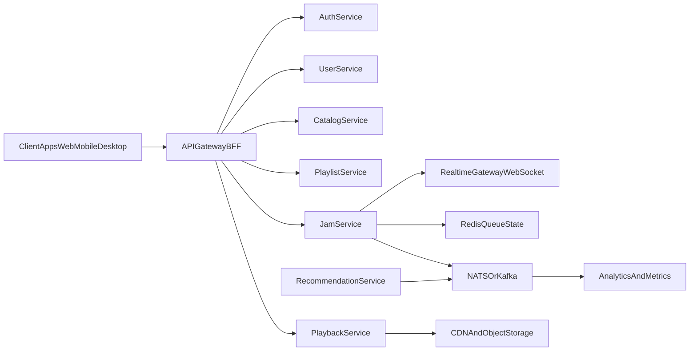
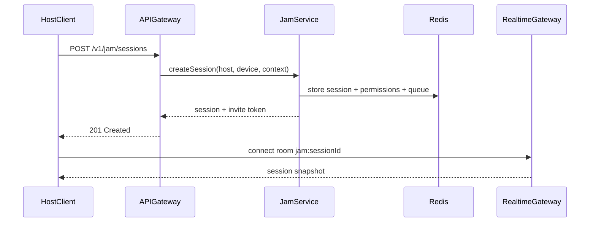
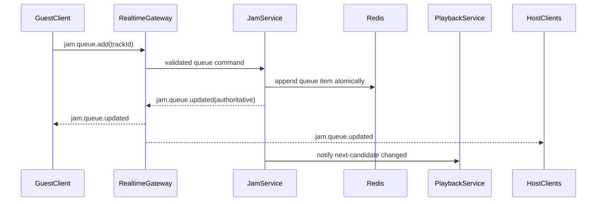
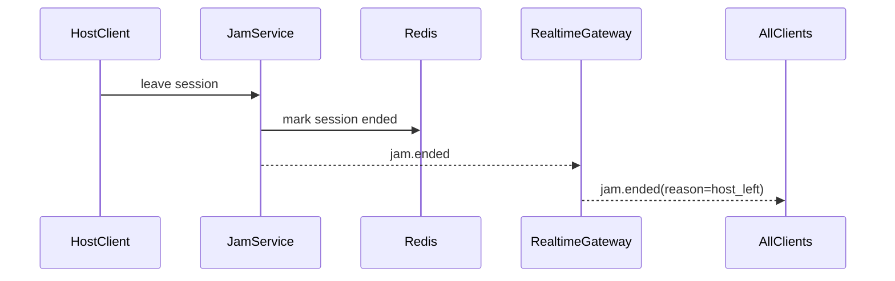

# Spotify-Like MVP + Jam - High Level Design (HLD)

## 1) Scope and Goals

This HLD defines an MVP music streaming platform (Spotify-like) with a first-class collaborative listening feature similar to Spotify Jam.

- Target scale: regional MVP, up to ~100K MAU
- Goal: reliable playback, collaborative queueing, and low-latency Jam control sync
- Non-goal (MVP): global multi-region active-active media platform

## 2) Verified Jam Requirements and Product Assumptions

### 2.1 Verified Jam behavior (reference baseline)

Based on Spotify public documentation and product announcements:

- Premium users can host a Jam session.
- Participants can join via invite link, QR, and proximity flow.
- Participants can add tracks to a shared queue.
- Host can control guest permissions (playback control / queue edits).
- If host leaves, session ends.
- Device capabilities constrain volume-sharing behavior on some cast paths.

References:
- [Spotify Support - Start or join a Jam](https://support.spotify.com/ws/article/jam/)
- [TechCrunch coverage of Spotify Jam launch](https://techcrunch.com/2023/09/26/spotify-launches-jam-a-real-time-collaborative-playlist-controlled-by-up-to-32-people/)

### 2.2 MVP assumptions for this design

- Max participants per Jam session: 32
- One active host device per Jam session
- Queue ordering is authoritative on server (not client)
- Control channel sync target is near-real-time (< 300 ms p95 for control events)
- Audio stream delivery remains CDN/HLS based for MVP (not peer media transport)
- A Jam session binds to a specific playback context (playlist/album/radio seed)

## 3) System Context

## 4) Service Boundaries (MVP)

### 4.1 API Gateway / BFF

- Public REST API entrypoint and token validation
- Request shaping by platform (web/mobile/desktop)
- Rate limiting, authZ checks, and response aggregation

### 4.2 Auth Service

- Login, token issuance/refresh, session lifecycle
- Subscription claims in access token (e.g. `plan=premium`)

### 4.3 User Service

- User profile preferences
- Social graph basics (friends/following) for invite UX

### 4.4 Catalog Service

- Track/artist/album metadata read APIs
- Search integration and metadata cache

### 4.5 Playlist Service

- Playlist CRUD and membership logic
- Playlist snapshot versioning (for consistency and audit)

### 4.6 Playback Service

- Playback state machine for host device context
- Next-track decision using queue + policy (shuffle/repeat mode)
- Generates secure stream URLs/tokens for media playback

### 4.7 Jam Service

- Session lifecycle: create/join/leave/end
- Participant and role management (`host`, `guest`)
- Permissions toggles (`canControlPlayback`, `canReorderQueue`, `canChangeVolume`)
- Shared queue command handling (append/reorder/remove/vote-ready hooks)
- Broadcasts authoritative session updates to Realtime Gateway

### 4.8 Realtime Gateway (WebSocket)

- Low-latency fanout for Jam control and queue updates
- Connection auth, room membership, heartbeat handling

### 4.9 Recommendation Service (MVP-light)

- Batch-generated recommendations by user + context
- Jam recommendation blending (group candidate ranking)

### 4.10 Analytics Pipeline

- Event ingestion from services
- Product metrics dashboards and alerting

## 5) Data Ownership and Storage

| Domain | Primary Store | Why |
|---|---|---|
| Users, auth accounts, subscriptions | PostgreSQL | Relational consistency and joins |
| Catalog metadata index | PostgreSQL + OpenSearch | Durable source + fast text search |
| Playlists and playlist tracks | PostgreSQL | Transactional writes and versioning |
| Jam ephemeral session state | Redis | Low-latency ephemeral reads/writes |
| Playback session cache | Redis | Fast state reads for active devices |
| Event stream | NATS (MVP) / Kafka (later) | Async decoupling and analytics feed |
| Audio objects/chunks | Object storage + CDN | Scalable media delivery |

Redis TTL policy:
- Jam session key TTL: 2 hours (extended on activity)
- Realtime presence key TTL: 60 seconds (refreshed by heartbeat)

## 6) Jam Domain Model (Logical)

- `JamSession(sessionId, hostUserId, hostDeviceId, status, startedAt, endedAt)`
- `JamParticipant(sessionId, userId, role, joinedAt, status)`
- `JamPermission(sessionId, canControlPlayback, canReorderQueue, canChangeVolume)`
- `JamQueueItem(sessionId, queueItemId, trackId, addedByUserId, position, createdAt)`
- `JamEvent(eventId, sessionId, type, actorUserId, payload, createdAt)`

## 7) API Surface (External)

### 7.1 Jam APIs (REST)

- `POST /v1/jam/sessions` -> create session (host only, Premium required)
- `POST /v1/jam/sessions/{sessionId}/join` -> join via token/link payload
- `POST /v1/jam/sessions/{sessionId}/leave` -> leave session
- `POST /v1/jam/sessions/{sessionId}/end` -> host ends session
- `GET /v1/jam/sessions/{sessionId}` -> session state snapshot
- `PATCH /v1/jam/sessions/{sessionId}/permissions` -> host toggles guest controls
- `POST /v1/jam/sessions/{sessionId}/queue/items` -> add track
- `PATCH /v1/jam/sessions/{sessionId}/queue/reorder` -> reorder items
- `DELETE /v1/jam/sessions/{sessionId}/queue/items/{queueItemId}` -> remove item
- `POST /v1/jam/sessions/{sessionId}/playback/commands` -> play/pause/next/prev seek

### 7.2 Realtime Channels (WebSocket)

- Client subscribes to room: `jam:{sessionId}`
- Server events:
  - `jam.session.updated`
  - `jam.participant.joined`
  - `jam.participant.left`
  - `jam.queue.updated`
  - `jam.playback.updated`
  - `jam.ended`
- Client commands (validated server-side):
  - `jam.queue.add`
  - `jam.queue.reorder`
  - `jam.queue.remove`
  - `jam.playback.command`

## 8) Key Flows

### 8.1 Create and Join Jam

### 8.2 Queue Update and Playback Sync

### 8.3 Host Leaves

## 9) Consistency, Concurrency, and Conflict Rules

- Server is source of truth for queue order and playback control state.
- Use optimistic concurrency versioning on queue (`queueVersion`) to reject stale reorder commands.
- Use Redis Lua or transaction primitives for atomic queue mutations.
- Idempotency key required for write commands from clients to avoid duplicate adds.
- Out-of-order realtime events reconciled by `eventVersion` on client.

## 10) Security and Abuse Controls

- JWT access token + short TTL + refresh token rotation
- Host privilege enforced server-side for session-end and permission updates
- Subscription gate for host creation (`premium_required`)
- Input validation for track IDs, queue payload size, and command frequency
- Rate limits:
  - Queue mutations: e.g. 20/min/user
  - Playback commands: e.g. 30/min/session
- Audit log events for moderation and dispute analysis

## 11) Observability and SLOs (MVP)

### 11.1 Golden Signals

- Latency: REST p95, WebSocket fanout p95
- Traffic: requests/sec, events/sec, active sessions
- Errors: 4xx/5xx rates, websocket disconnect reasons
- Saturation: Redis CPU/memory, gateway connection count

### 11.2 Proposed MVP SLOs

- API availability: 99.9% monthly (`/v1/*`)
- Jam command-to-fanout latency: p95 < 300 ms
- Session join success rate: >= 99.5%
- Playback command success rate: >= 99.5%

## 12) Recommended MVP Tech Stack

### 12.1 Application Layer

- Web app: React + TypeScript
- Mobile app: Flutter (single codebase) or React Native
- Desktop app (optional): Electron shell over web stack

### 12.2 Backend and Realtime

- Core services: Go (good fit for realtime concurrency and lower memory footprint)
- External APIs: REST/JSON
- Internal service-to-service: gRPC
- Realtime: WebSocket gateway (Go) with room fanout through Redis pub/sub

### 12.3 Data and Messaging

- PostgreSQL: core relational entities (users, subscriptions, playlists)
- Redis: Jam ephemeral state, session cache, rate-limit counters
- OpenSearch: catalog search
- Event bus: NATS for MVP simplicity, Kafka when retention/throughput needs grow

### 12.4 Media Delivery

- Object storage (S3-compatible) for audio assets
- CDN for segment distribution
- HLS playback for broad client compatibility in MVP

### 12.5 Infrastructure and DevEx

- Containerization: Docker
- Orchestration: Kubernetes (or ECS if team prefers managed path)
- IaC: Terraform
- CI/CD: GitHub Actions

### 12.6 Observability and Ops

- OpenTelemetry instrumentation
- Prometheus + Grafana for metrics
- Loki or ELK for logs
- Sentry for client/server error tracking

### 12.7 Stack Alternatives and Trade-offs

- Node.js backend is viable for MVP speed, but Go is preferred for predictable websocket concurrency at load.
- Kafka can be deferred to reduce operational overhead until event replay and higher throughput are required.
- If Kubernetes is too heavy for team size, ECS/Fargate is an acceptable MVP compromise.

## 13) Capacity and Sizing (MVP Starting Point)

- Peak concurrent Jam sessions: 1,000
- Avg participants per active session: 5
- Peak websocket connections: 10,000-20,000 including non-Jam realtime channels
- Redis cluster: start with primary + replica, memory sized for session/queue TTL footprint
- Postgres: single primary + read replica once read-heavy patterns emerge

## 14) Risks and Mitigations

- Drift between playback state and queue state
  - Mitigation: authoritative playback updates include queue version + track position
- Realtime gateway overload
  - Mitigation: horizontal autoscale by active connection count and event fanout lag
- Abuse (spam queue edits, command flood)
  - Mitigation: per-user and per-session limits, temporary mute/ban controls
- Recommendation quality in mixed-taste groups
  - Mitigation: start with weighted blend heuristic and improve with online feedback

## 15) Phased Delivery Roadmap

### Phase 1 - Core Streaming Platform

- Auth/subscription, catalog, playlist, playback basics
- CDN-based streaming and device session management

### Phase 2 - Jam MVP

- Session create/join/leave/end
- Shared queue with host permissions
- Realtime fanout and queue/playback sync

### Phase 3 - Personalization for Jam

- Group recommendation ranking
- Better context-aware suggestions and feedback loops

### Phase 4 - Hardening and Scale

- Anti-abuse expansions, DR runbooks, load testing
- Multi-AZ resilience, operational automation, cost optimization

## 16) Definition of Done for HLD

- Service boundaries and ownership are explicit.
- Jam state machine and permission model are defined.
- API and realtime contracts are clear enough for parallel implementation.
- MVP stack and trade-offs are documented.
- SLOs and operational controls are specified for launch readiness.