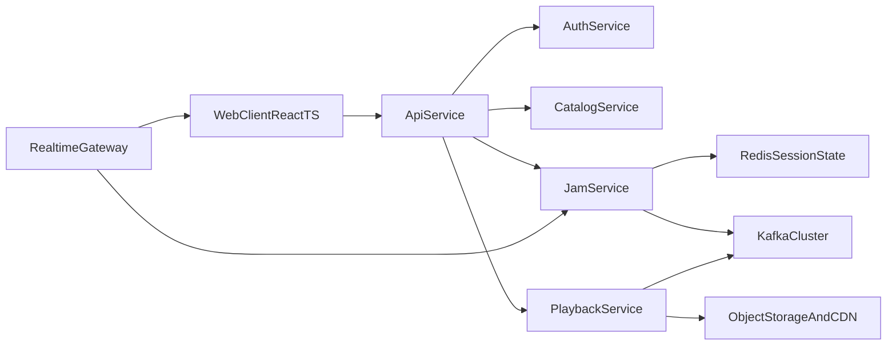
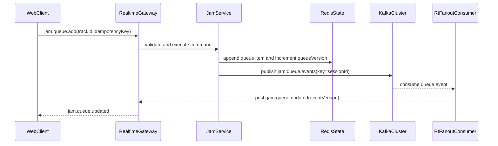

# Spotify-Like + Jam - Phased Low Level Design (LLD)

This document provides implementation-level design split by delivery phases, aligned with `docs/hld/spotify-like-with-jam.md`.

## 1) Scope and Constraints

- Target scale: regional MVP, up to ~100K MAU
- Jam baseline: host-led session, shared queue, realtime control updates
- Messaging backbone in all phases: Kafka
- Revised MVP subset excludes:
  - mobile client
  - Nginx
  - Docker
  - OpenTelemetry + Prometheus + Grafana
  - Sentry

## 2) Cross-Phase Technical Baseline

### 2.1 Runtime Components

- Web client: React + TypeScript
- API service: Go (`api-service`)
- Jam service: Go (`jam-service`)
- Playback service: Go (`playback-service`)
- Auth service: Go (`auth-service`)
- Catalog service: Go (`catalog-service`)
- Realtime gateway: Go WebSocket gateway (`rt-gateway`)

### 2.2 Data Components

- PostgreSQL: durable relational data
- Redis: ephemeral session, queue cache, presence
- Kafka: async event streaming and decoupled processing
- Object storage + CDN + HLS: audio delivery path

### 2.3 Jam Event Envelope (all phases)

```json
{
  "eventId": "uuid",
  "eventType": "jam.queue.item.added",
  "sessionId": "jam_123",
  "aggregateVersion": 42,
  "actorUserId": "user_77",
  "occurredAt": "2026-03-30T10:00:00Z",
  "payload": {}
}
```

Rules:
- `aggregateVersion` is strictly monotonic per `sessionId`.
- Kafka message key = `sessionId` to preserve partition ordering for session events.
- Consumers must deduplicate using `eventId`.

## 3) Phase 1 (MVP) - Core + Jam Basics

### 3.1 MVP Subset (Revised)

Included for MVP:
- Web client only (React + TypeScript)
- Go backend services (modular deployment allowed)
- PostgreSQL, Redis, Kafka
- Object storage + CDN + HLS
- Basic CI with GitHub Actions

Explicitly excluded in MVP subset:
- mobile client
- Nginx
- Docker
- OpenTelemetry + Prometheus + Grafana
- Sentry

### 3.2 Phase 1 Component Flow



### 3.3 Data Model (Phase 1)

PostgreSQL tables:
- `users(id, email, plan, created_at, updated_at)`
- `sessions(id, user_id, refresh_token_hash, expires_at, created_at)`
- `tracks(id, title, artist_id, album_id, duration_ms, hls_manifest_url)`
- `playlists(id, owner_user_id, name, is_public, version, created_at, updated_at)`
- `playlist_tracks(id, playlist_id, track_id, position, added_by_user_id, created_at)`

Redis keys:
- `jam:session:{sessionId}` -> hash (host, status, permissions, queueVersion)
- `jam:queue:{sessionId}` -> list (queue item IDs ordered)
- `jam:presence:{sessionId}` -> set (active participant IDs), TTL 60s

### 3.4 Jam API Contracts (Phase 1)

1) Create session
- `POST /v1/jam/sessions`
- Request:
```json
{
  "deviceId": "web_player_1",
  "contextType": "playlist",
  "contextId": "pl_123"
}
```
- Response `201`:
```json
{
  "sessionId": "jam_123",
  "inviteToken": "inv_xxx",
  "permissions": {
    "canControlPlayback": false,
    "canReorderQueue": false,
    "canChangeVolume": false
  }
}
```

2) Add queue item
- `POST /v1/jam/sessions/{sessionId}/queue/items`
- Request:
```json
{
  "trackId": "trk_9",
  "idempotencyKey": "e8a1-..."
}
```
- Response `200`:
```json
{
  "queueItemId": "qi_456",
  "queueVersion": 43
}
```

3) Playback command
- `POST /v1/jam/sessions/{sessionId}/playback/commands`
- Request:
```json
{
  "command": "next",
  "clientEventId": "evt_33"
}
```
- Response `202`:
```json
{
  "accepted": true
}
```

Common errors:
- `400 invalid_payload`
- `401 unauthorized`
- `403 premium_required` or `403 host_only`
- `404 session_not_found`
- `409 version_conflict`
- `429 rate_limited`

### 3.5 Realtime Protocol (Phase 1)

WS channel: `jam:{sessionId}`

Server events:
- `jam.session.updated`
- `jam.participant.joined`
- `jam.queue.updated`
- `jam.playback.updated`
- `jam.ended`

Event payload minimum:
```json
{
  "eventType": "jam.queue.updated",
  "sessionId": "jam_123",
  "eventVersion": 43,
  "data": {}
}
```

Client reconcile rule:
- Ignore events with `eventVersion <= localVersion`.
- If gap detected (`eventVersion > localVersion + 1`), fetch snapshot using `GET /v1/jam/sessions/{sessionId}`.

### 3.6 Kafka Design (Phase 1)

Topics:
- `jam.session.events` (partitions: 12, key: `sessionId`, retention: 7d)
- `jam.queue.events` (partitions: 24, key: `sessionId`, retention: 7d)
- `jam.playback.events` (partitions: 12, key: `sessionId`, retention: 7d)
- `analytics.user.actions` (partitions: 24, key: `userId`, retention: 14d)

Producers:
- `jam-service` -> `jam.session.events`, `jam.queue.events`
- `playback-service` -> `jam.playback.events`
- `api-service` -> `analytics.user.actions`

Consumer groups:
- `rt-gateway-fanout` (queue/playback events to websocket rooms)
- `analytics-etl` (warehouse/load jobs)
- `audit-writer` (append event audit trails)

### 3.7 Phase 1 Runbook-Lite Checks

- Can host create/join/end Jam with premium account
- Queue append/reorder/remove correctness under concurrent requests
- End-to-end command-to-fanout latency p95 under load
- Session cleanup when host disconnects/leaves

## 4) Phase 2 - Jam Control and Consistency Upgrades

### 4.1 Enhancements

- Stronger queue conflict handling (server-side CAS + retry policy)
- Guest permissions granular toggles per action
- Participant moderation (kick/mute from queue edits)
- Playback synchronization with explicit `playbackEpoch`

### 4.2 Kafka Design (Phase 2)

New/updated topics:
- `jam.permission.events` (key: `sessionId`, retention: 14d)
- `jam.moderation.events` (key: `sessionId`, retention: 30d)

Consumer additions:
- `policy-enforcer` (permission/mute state projection)
- `fraud-abuse-detector` (queue-spam and command-flood heuristics)

### 4.3 Consistency Rules

- Queue reorder requests require `expectedQueueVersion`.
- Reject stale updates with `409 version_conflict`.
- Playback updates include both `queueVersion` and `playbackEpoch`.

## 5) Phase 3 - Personalization and Recommendation

### 5.1 Enhancements

- Group recommendation service with weighted ranking
- Context-aware suggestions using recent Jam interaction signals
- Feedback loop from skips/likes/adds

### 5.2 Kafka Design (Phase 3)

Topics:
- `recommendation.features` (key: `sessionId`, retention: 14d)
- `recommendation.outputs` (key: `sessionId`, retention: 3d)

Consumers:
- `feature-builder`
- `ranker-online`
- `rec-serving-cache-updater`

## 6) Phase 4 - Hardening and Scale

### 6.1 Enhancements

- Multi-AZ deployment hardening and failover drills
- Capacity automation and partition scaling policy
- Backpressure controls in realtime fanout path
- Advanced abuse detection and rate policy tuning

### 6.2 Kafka Design (Phase 4)

- Increase partitions based on observed throughput per topic
- Enable stricter producer acks and idempotent producers where needed
- Define topic-level compaction for long-lived state streams (if adopted)
- Formalize retention/SLA mapping by topic criticality

## 7) Kafka Topic Matrix by Phase

| Topic | P1 | P2 | P3 | P4 |
|---|---|---|---|---|
| jam.session.events | Yes | Yes | Yes | Yes |
| jam.queue.events | Yes | Yes | Yes | Yes |
| jam.playback.events | Yes | Yes | Yes | Yes |
| analytics.user.actions | Yes | Yes | Yes | Yes |
| jam.permission.events | No | Yes | Yes | Yes |
| jam.moderation.events | No | Yes | Yes | Yes |
| recommendation.features | No | No | Yes | Yes |
| recommendation.outputs | No | No | Yes | Yes |

## 8) Queue Command Path With Kafka



## 9) Playback/Jam Sync With Version Check

```mermaid
sequenceDiagram
  participant Host as HostClient
  participant Play as PlaybackService
  participant Kafka as KafkaCluster
  participant RT as RealtimeGateway
  participant Guest as GuestClient

  Host->>Play: command next(expectedQueueVersion=88)
  Play->>Play: verify queueVersion and playbackEpoch
  Play->>Kafka: publish jam.playback.events(key=sessionId)
  Kafka-->>RT: playback event consumed
  RT-->>Guest: jam.playback.updated(eventVersion=89)
  Guest->>Guest: apply if eventVersion is next; else snapshot
```

## 10) Acceptance Checklist

- LLD is separated by MVP and later phases with implementation-level detail.
- Kafka is defined as the event bus in every phase.
- Revised MVP subset excludes mobile client, Nginx, Docker, OpenTelemetry+Prometheus+Grafana, and Sentry.
- API contracts, realtime protocol, data model, and key diagrams are included.
- LLD remains aligned with assumptions in the HLD baseline.
