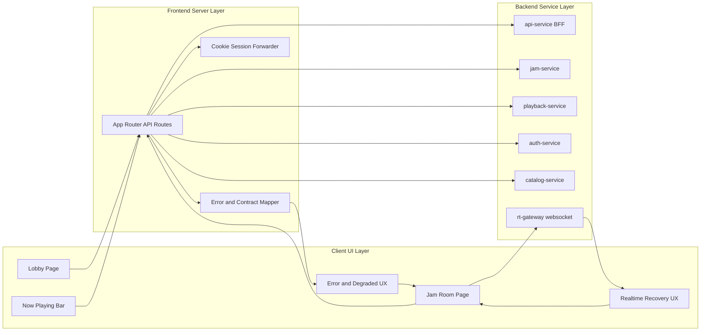
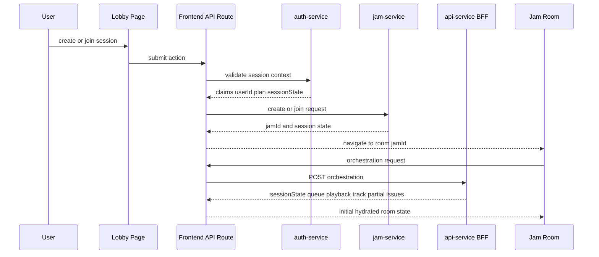
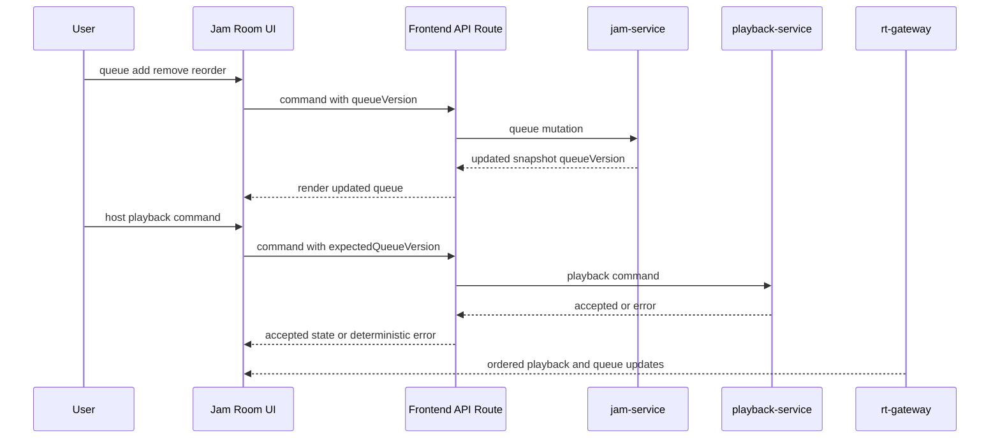
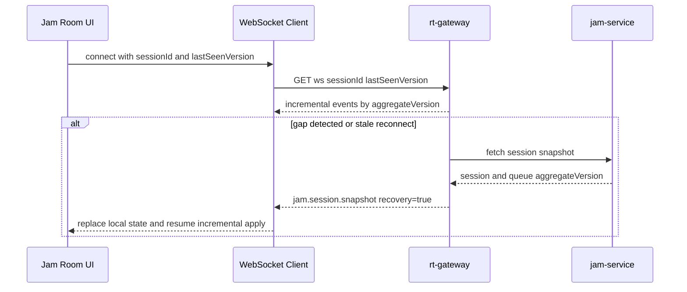
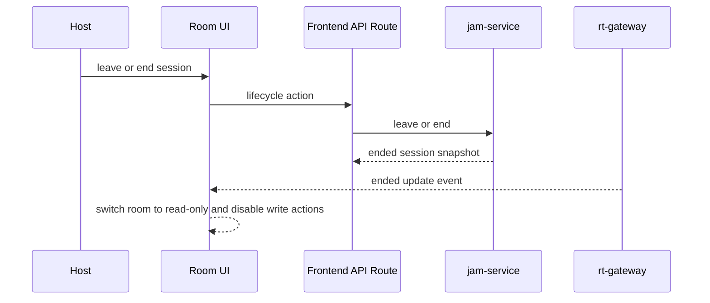

# Frontend Phase 1 HLD (2 Layers)

This document expands architecture detail into two layers:
- Layer 1: Logical architecture and ownership boundaries.
- Layer 2: Runtime sequence flows for end-to-end behavior.

## Scope
- Phase 1 web frontend only.
- Spotify-like Jam experience using shadcn components.
- Browser calls only through frontend API routes.

## Service requirement files by dependency rank
1. ../services/00-service-dependency-ranking.md
2. ../services/01-auth-service-requirements.md
3. ../services/02-catalog-service-requirements.md
4. ../services/03-jam-service-requirements.md
5. ../services/04-playback-service-requirements.md
6. ../services/05-rt-gateway-requirements.md
7. ../services/06-api-service-bff-requirements.md

## Layer 1: Logical Architecture

### 1.1 Component and service boundaries

### 1.2 State ownership model
1. Authoritative room state comes from jam snapshot and BFF orchestration.
2. Queue and playback transitions are accepted only from backend responses and ordered realtime events.
3. Client local state is a projection, not source of truth.
4. aggregateVersion controls realtime ordering.
5. queueVersion controls command concurrency and stale conflict recovery.

### 1.3 Error contract and UX mapping
- Blocking states:
  - unauthorized
  - premium_required
  - session_ended
- Action-level states:
  - host_only
  - version_conflict
  - track_not_found
  - track_unavailable
- Dependency states:
  - dependency_timeout
  - dependency_unavailable
  - partial=true from BFF

## Layer 2: Runtime Sequence Flows

### 2.1 Create or join -> room hydrate

### 2.2 Queue and playback command flow

### 2.3 Realtime gap and reconnect recovery

### 2.4 Session ended flow

## Spotify-like component guidance (shadcn)
1. Shell layout: sidebar + content + persistent player bar.
2. Lobby actions: Card, Tabs, Input, Button, Alert, Toast.
3. Room queue: ScrollArea, Card, DropdownMenu, Skeleton.
4. Playback controls: Button group, Slider, Tooltip.
5. Lifecycle confirmations: Dialog and Sheet for mobile.
6. Realtime feedback: Badge for connection, Toast for recovery.

## Acceptance checklist
1. Create and join route to hydrated room successfully.
2. Queue mutation and playback commands honor queueVersion and role checks.
3. Realtime events are monotonic and duplicates are ignored.
4. Gap and reconnect recovery replaces stale local state.
5. Ended sessions enforce read-only UI and deterministic messaging.
